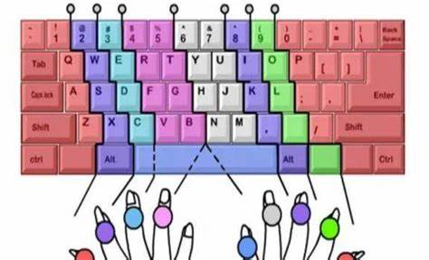

# 实验1：打字

## 内容

## 思路

关于打字和编程的关系，其实网上有不少的说法。基本上，像我们这样的新生代程序员都没有系统训练过打字，也没有学过像五笔之类的输入法。

虽然编程的具体工作内容和打字没什么联系，不过吧，码多了，我有一种感觉，如果打字的指位不正确，或者使用拼音输入，很影响输入速度。不是说越快越好，就是总有一种膈应的赶脚。

如果你觉得有必要的话，可以网上搜索相关教程。
> **为啥五笔会比拼音快？**
> 在很多年以前的中文输入法领域，有两个概念：内码和外码。
> 内码就是GBK, UTF-8之类的东西，对应者相应的汉字字形；而外码就是我们平时用输入法输入的拉丁字母。
> 外码的输入分为两种，一个是音码输入，一个是形码输入。
>
> 音码大多数情况下就是拼音输入，虽然现在拼音输入法已经相当智能化，但是重码现象仍然很常见，
> 就是你输入一个拼音，有非常多候选词，你想要的候选词可能会放在非常后面。而五笔属于形码输入，它是依据字形编码的，
> 显而易见，重码率会大大降低，而且每个汉字最多只需要输入4个拉丁字母就可以找得到对应的汉字，再加上智能化加持，可以让你打字速度健步如飞。

***

搜索“金山打字通”，

点击官网下载安装，

根据安装程序指示安装使用即可。

## 奇淫技巧

事实上，金山打字通可以导入自定义打字文件，基于此，我们可以作弊。下面展示以下如何作弊而不被发现，_好孩子千万不要学_。

1. 在主界面找到“打字测试”，点进去，默认是一篇叫`WHO AM I`的文章。

2. 我们现在就找找，这篇文章到底藏在哪里。一般情况下，它一般藏在`C:\Users\[你的用户名]\AppData\Local\Typeeasy\12.3\course\test\en`中。
3. 打开它，我们很容易发现其文本的内容，复制粘贴到一个文本文档中。

4. 在文档的头部添加**330**个相同的字符，这里我用a。后面你会知道为什么。

5. 按照图示导入文本文档，必须命名为`WHO AM I `，后面多一个空格。（具体原因是因为这个软件卡的是字符串）

6. 然后……

7. 按照一定节奏不停地按a，到了最后惊奇发现……

8. 最后别忘记作业要求，同时做得节制点，1分钟300字以上的建议开除球籍。
